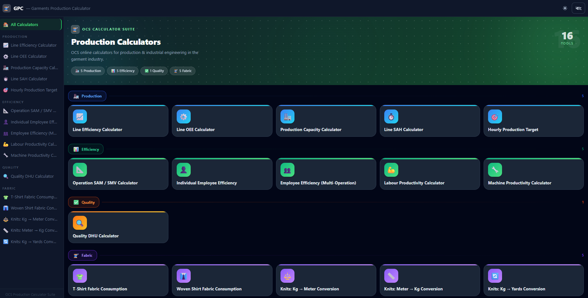

# 🧵 OCS Garments Production Calculator Suite

> **16 professional production calculators** in one fast, beautiful web app — built for the garments & apparel industry. Works on any device, supports Bangla & English, includes dark mode, and is fully APK-ready.



---

## ✨ Features

- **16 Calculators** across 4 categories — Production, Efficiency, Quality & Fabric
- **Bilingual** — English & বাংলা language toggle
- **Dark / Light Mode** — defaults to dark, persists preference
- **Responsive** — mobile-first with bottom tab navigation; two-column layout on desktop
- **APK-ready** — hash routing so it runs as a packaged Android app (via WebView/TWA)
- **Zero backend** — fully static, no server required
- **Fast** — code-split per calculator, ~1.2 s build, < 50 KB CSS

---

## 📸 Screenshots

| Dashboard | Line Efficiency |
|-----------|----------------|
|  |  |

| Operation SAM / SMV | Quality DHU |
|---------------------|-------------|
|  |  |

| T-Shirt Fabric Consumption |
|---------------------------|
|  |

---

## 🗂️ Calculator Categories

### 🏭 Production (5 tools)
| Calculator | What it does |
|------------|-------------|
| Line Efficiency | Measures sewing line efficiency vs. available capacity |
| Line OEE | Overall Equipment Effectiveness (Availability × Performance × Quality) |
| Production Capacity | Daily capacity based on operators, hours, SAM & efficiency |
| Line SAH | Standard Allowed Hours earned by a line |
| Hourly Production Target | Per-operator and full-line hourly targets |

### 📊 Efficiency (5 tools)
| Calculator | What it does |
|------------|-------------|
| Operation SAM / SMV | Calculates Standard Allowed Minutes from observed time + rating + allowance |
| Individual Employee Efficiency | Single operator efficiency vs. target |
| Employee Efficiency (Multi) | Batch efficiency calculator for an entire team with breakdown table |
| Labour Productivity | Output per person per day/hour |
| Machine Productivity | Output per machine per hour/day |

### ✅ Quality (1 tool)
| Calculator | What it does |
|------------|-------------|
| Quality DHU | Defects per Hundred Units + rejection rate with quality rating badge |

### 🧵 Fabric (5 tools)
| Calculator | What it does |
|------------|-------------|
| T-Shirt Fabric Consumption | Fabric weight (g & kg) per piece from measurements + GSM |
| Woven Shirt Fabric Consumption | Meter consumption for woven shirts with marker efficiency |
| Knits: Kg → Meter | Convert fabric weight to length |
| Knits: Meter → Kg | Convert fabric length to weight |
| Knits: Kg → Yards | Convert fabric weight to yards |

---

## 🛠️ Tech Stack

| Layer | Technology |
|-------|-----------|
| Framework | [Vue 3](https://vuejs.org/) (Composition API, `<script setup>`) |
| Routing | [Vue Router 4](https://router.vuejs.org/) — hash history for APK |
| Styling | [Tailwind CSS v3](https://tailwindcss.com/) — `darkMode: 'class'` |
| Build | [Vite 5](https://vitejs.dev/) — lazy-loaded routes per calculator |
| i18n | Custom composable (`useLang`) — no external dependency |
| Theme | Custom composable (`useTheme`) — persists to localStorage |

---

## 🚀 Getting Started

### Prerequisites
- Node.js 18+ (tested with v22.14.0)

### Install & Run
```bash
# Clone the repo
git clone https://github.com/YOUR_USERNAME/garments-production-calculator.git
cd garments-production-calculator

# Install dependencies
npm install

# Start dev server
npm run dev
```

Open [http://localhost:5173](http://localhost:5173) in your browser.

### Build for Production
```bash
npm run build
# Output goes to dist/ — serve any static file host
```

### Preview Production Build
```bash
npm run preview
```

---

## 📱 APK / Android

Because the app uses hash routing (`createWebHashHistory`) and is fully static, you can wrap it in a WebView or Trusted Web Activity (TWA) to generate an Android APK with no code changes. Just point the WebView at `index.html` from the `dist/` folder.

---

## 📁 Project Structure

```
src/
├── components/
│   └── CalcLayout.vue          # Two-column desktop wrapper (inputs | results)
├── composables/
│   ├── useLang.js              # i18n (EN / বাং)
│   └── useTheme.js             # Dark / light mode
├── i18n/
│   ├── en.js                   # English translations
│   └── bn.js                   # Bangla translations
├── router/
│   └── index.js                # 17 routes, lazy-loaded
├── views/
│   ├── Home.vue                # Animated dashboard with category cards
│   └── calculators/            # 16 calculator views
│       ├── LineEfficiency.vue
│       ├── LineOEE.vue
│       ├── ProductionCapacity.vue
│       ├── LineSAH.vue
│       ├── HourlyTarget.vue
│       ├── OperationSAM.vue
│       ├── EmployeeEfficiency.vue
│       ├── EmployeeEfficiencyMulti.vue
│       ├── LabourProductivity.vue
│       ├── MachineProductivity.vue
│       ├── QualityDHU.vue
│       ├── TShirtFabric.vue
│       ├── WovenShirtFabric.vue
│       ├── KgToMeter.vue
│       ├── MeterToKg.vue
│       └── KgToYards.vue
├── App.vue                     # Shell: header, sidebar, bottom nav, drawer
└── style.css                   # Tailwind layers + shared component classes
```

---

## 🌐 Formulas Reference

All calculation logic is inline in each view component. Key formulas:

```
Line Efficiency (%)    = (Pieces × SAM) / (Operators × Hours × 60) × 100
OEE (%)                = Availability × Performance × Quality / 10,000
Production Capacity    = (Operators × Hours × 60 × Efficiency%) / (SAM × 100)
DHU                    = (Total Defects / Pieces Inspected) × 100
SAM                    = Observed Time × (Rating / 100) × (1 + Allowance / 100)
Fabric (g/pc)          = Total area (cm²) × GSM / 10,000
Kg → Meter             = (kg × 1,000 × 100) / (GSM × Width_cm)
```

---

## 🤝 Contributing

Pull requests are welcome! For major changes, open an issue first to discuss what you'd like to change.

1. Fork the repo
2. Create your feature branch (`git checkout -b feature/new-calculator`)
3. Commit your changes
4. Push to the branch and open a Pull Request

---

## 📄 License

MIT — free to use, modify, and distribute.

---

<div align="center">
  <strong>Built with ❤️ for the Garments & Apparel Industry</strong><br/>
  <sub>Inspired by <a href="https://www.onlineclothingstudy.com">Online Clothing Study (OCS)</a></sub>
</div>
